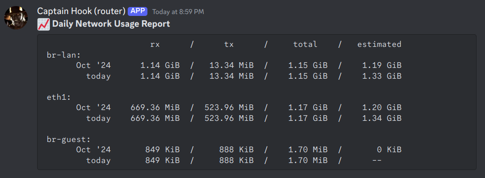

# router-scripts

These are a couple scripts that I have running on OpenWRT which send notifications to Discord whenever some changes occur.

## IP Scan

`ipscan.sh` uses `arp-scan` to look at the interface and send a notification whenever a new device is observed. It does a differential analysis between the current and last scan, then compares those against a list of known devices.

Maintaining a list of known devices ensures that this script doesn't generate a bunch of noise due to IoT trinkets which have a tendency to pop in and out of scans (for whatever reason). I only want to be notified when a new mac address is observed.

_Note:_ Apple devices can be somewhat annoying with their "Private Addressing" since this will randomize the mac address. You can turn it off in the network settings.


### Dependencies

Install `arp-scan` with `opkg`.

```sh
opkg update
opkg install arp-scan
opkg install arp-scan-database
```

I also had to make a symlink for  `mac-vendor.txt` file because the application was looking for it under `/etc/arp-scan`, but `opkg` installed it in `/usr/share/arp-scan`. These database files are what allow `arp-scan` to (approximately, and only sporadically) identify the types of devices.

```sh
mkdir /etc/arp-scan
ln -s /usr/share/arp-scan/mac-vendor.txt /etc/arp-scan/mac-vendor.txt
```

### Cron Job

I run this every 15 minutes via cron.

```sh
crontab -e
```

Save the script to `/usr/local/bin` and add the following.

```sh
*/15 * * * * /usr/local/bin/ipscan.sh
```

## Traffic Analysis

Once per day I capture a summary of network activity using `vnstat` via the `vnnotify.sh` script.



### Dependencies

Install `vnstat`.

```sh
opkg update
opkg install vnstat
```

It takes a while for `vnstat` to collect data. If you want to force it, run:

```sh
vnstat -u
```

### Cron Job

Add the following to cron.

```sh
30 23 * * * /usr/local/bin/vnnotify.sh
```

## CPU/Mem/Disk Usage

See [my other repo here](https://github.com/sbarbett/cpu-mem-disk-chk/). You'll need to modify the shebang to use `/bin/sh` instead of `/bin/bash`, but it should otherwise work.
